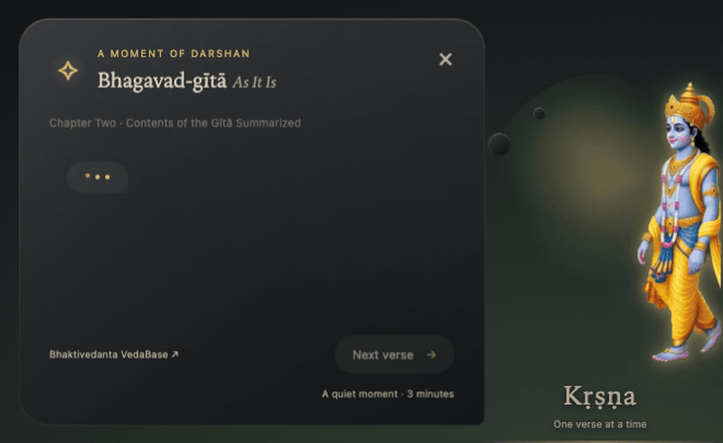

# Krishna Companion

[](https://github.com/deepkanchalia/krishna-companion/actions/workflows/ci.yml)

A quiet Bhagavad-gītā companion for long terminal sessions. Kṛṣṇa walks into view, a verse opens, and he withdraws. Your work keeps running.



## What it does

- Every 30 minutes (or on your invitation) a verse from *Bhagavad-gītā As It Is* appears as a darshan: a figure walks in, the verse opens, he withdraws.
- The text is verbatim. Each verse and the opening of its purport are copied word for word from the BBT-authorized VedaBase edition. Nothing is paraphrased.
- There is no language model. No chat, no generated text.
- Nothing leaves the machine. The app makes no network request of its own.
- The journey runs Chapter 1 text 1 through all 700 verses in order, and your place is saved locally.

## Quickstart (macOS)

You need Node.js 22.12 or newer (Electron 44.2 requires it). From a clean clone:

```bash
git clone https://github.com/deepkanchalia/krishna-companion.git
cd krishna-companion
npm install --ignore-scripts
mkdir -p ~/.local/bin
ln -s "$PWD/bin/krshna.js" ~/.local/bin/krshna
export PATH="$HOME/.local/bin:$PATH"                     # this shell
echo 'export PATH="$HOME/.local/bin:$PATH"' >> ~/.zshrc  # future shells
krshna install   # optional: adds /krshna, the status segment, and the Claude Code hook
krshna           # make the companion live
```

`--ignore-scripts` skips the native rebuild of `uiohook-napi`, which is used only by voice; voice is off by default, so the companion runs without it. The first launch still downloads Electron (about 90 MB) on demand even after `--ignore-scripts`, so allow time for that download the first time you run `krshna`.

To enable voice later, run a plain `npm install` (no `--ignore-scripts`). That rebuilds `uiohook-napi`, which needs the Xcode Command Line Tools (`xcode-select --install`). See the Voice section below.

`krshna install` writes or refreshes four paths and nothing else:

- `~/.zshrc`: it appends one marked block that adds the `/krshna` command and a `🪶 Kṛṣṇa · 30m` right-prompt.
- `~/.claude/settings.json`: it adds one marked `UserPromptSubmit` hook entry for Claude Code.
- `~/.zshrc.krshna-backup` and `~/.claude/settings.json.krshna-backup`: a snapshot of each file as it was before the last install.

`krshna uninstall` removes exactly the two additions above, byte for byte, and leaves the rest of both files untouched. It leaves the two `*.krshna-backup` snapshots in place; delete them by hand when you no longer want them. If it ever finds `settings.json` unparseable, it moves the damaged file aside to `settings.corrupt-<timestamp>.json` rather than editing it.

The `krshna` command returns at once; the companion runs in the background while you use a shell or a terminal agent. `krishna` is an alias for `krshna`, and `krshna start` is an alias for the bare `krshna`.

```bash
krshna now       # invite a teaching now
krshna pause     # quiet mode
krshna resume
krshna status
krshna context   # the previous teaching and the next verse
krshna stop
```

`pause`, `resume`, and `stop` act only on a running companion; they do not start one.

## Figures

Six figures ship. Five are flipbooks cut from one generated clip each: `realistic` (the default), `cartoon`, `painterly`, `gyan` (the teacher), and `warrior`. The sixth, `pixel`, is the warrior redrawn as pixel art. Pick one from the tray Figure menu, or:

```bash
krshna style cartoon
```

The choice is saved and applies at once, even while Kṛṣṇa is present. How the figures were made is in [docs/ANIMATION.md](docs/ANIMATION.md).

## Voice

Voice is off by default, so a first launch asks for no permission. Turn it on with the tray checkbox or:

```bash
krshna voice on
krshna voice off
```

While voice is on, keep Terminal or a supported editor frontmost and hold Space for two seconds, then say "Hare Kṛṣṇa" to open the next teaching. Enabling voice can raise up to five macOS permission prompts: Input Monitoring, Accessibility, and Automation (for the global key hook and frontmost-app check) and Microphone and Speech Recognition (for the on-device recognizer). It also needs the Xcode Command Line Tools to build the on-device speech helper on first use. Recognition is forced to Apple's on-device recognizer; audio and transcripts are never saved, logged, or sent anywhere. A voice-off first launch asks for none of these. Windows and Linux run the companion without voice.

## Claude Code hook and zsh segment

`krshna install` registers a Claude Code prompt hook: typing "Hare Kṛṣṇa" as the whole prompt opens the next teaching, and the model never receives it. The `/krshna` zsh command summons a teaching, and a right-prompt segment shows the next teaching's countdown. The zsh segment reads `state.json` directly and spawns no process.

## Tray

The menu-bar icon is a peacock feather. From it you can show a teaching, pause or resume the schedule, change the cadence to 30, 60, or 90 minutes, switch the figure, and toggle voice. The shortcut `⌘⌥K` (`Ctrl+Alt+K` elsewhere) calls up a teaching at any time.

## Settings and files

Three small JSON files live in the app's data directory:

- `state.json`: whether the app is live, the timer, and the next reference.
- `journey.json`: the next verse index and up to 100 past teachings.
- `settings.json`: the darshan position, the figure style, and the voice settings.

On macOS these are under `~/Library/Application Support/krishna-companion/`. Linux uses the standard config directory and Windows uses AppData. Run `krshna context` to see the last teaching and what comes next.

## Preview and options

To see the renderer without starting Electron, requesting permissions, or touching your saved journey:

```bash
node scripts/preview-darshan.js
# open http://127.0.0.1:4173
```

Options on launch:

```bash
npm start -- --interval=45 --duration=20 --demo --verse=2.47
```

- `--interval`: minutes between teachings (default 30)
- `--duration`: override the untouched timeout in seconds (default three minutes)
- `--demo`: show a teaching just after launch
- `--verse`: preview one verse without changing saved progress, for example `--verse=1.32-35`

## How it is built

- [docs/ARCHITECTURE.md](docs/ARCHITECTURE.md): the three processes, the data files, the security model, and the test strategy, in five minutes.
- [docs/ANIMATION.md](docs/ANIMATION.md): the flipbook, where the timings live, and how to rebuild the sheets.
- [docs/HOW-IT-WAS-BUILT.md](docs/HOW-IT-WAS-BUILT.md): the operating system behind the build.
- [docs/SUCCESS-CRITERIA.md](docs/SUCCESS-CRITERIA.md): the acceptance bar every change is measured against.

## Privacy

The running app never reads or stores your terminal output, source code, or conversations. The one exception is the optional Claude Code prompt hook: when it is enabled, each prompt you submit is checked in memory to detect the "Hare Kṛṣṇa" invocation, and is never stored, logged, or forwarded. The running app makes no network request of its own; the only outbound action is opening a VedaBase verse URL in your browser on an explicit click. Voice, when on, runs entirely on device and writes no audio or transcript.

## Platform support

macOS is where the app is built and used daily. Linux runs in CI and needs a compositor for the transparent window; it is not yet tested by a person. Windows is experimental: its CI lane reports but never blocks.

## License

The MIT license in [LICENSE](LICENSE) covers the software code only. The Bhagavad-gītā As It Is text and the artwork are not MIT licensed; their terms are in [LICENSE-ASSETS.md](LICENSE-ASSETS.md). This is an independent project and is not affiliated with or endorsed by ISKCON, the Bhaktivedanta Book Trust, or VedaBase.
