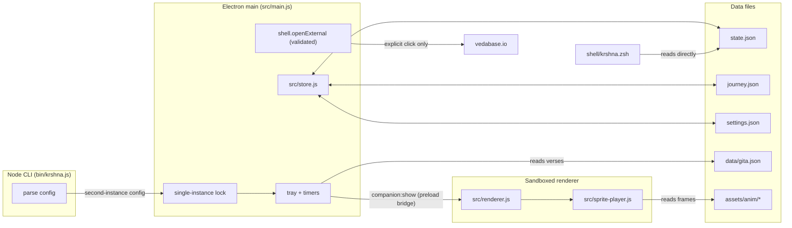

# Architecture

Krishna Companion is a macOS-first menu-bar app with a command-line front end. It
shows verbatim Bhagavad-gītā As It Is verses as a darshan: a figure walks in,
the verse opens, the figure withdraws. There is no language model and no network
call from the running app. This page is the five-minute tour for an engineer
reading the code. Every claim names a file.

## The three processes

- Electron main process (`src/main.js`). Owns the tray, the single companion
  window, saved placement, the hidden-window lifecycle, focus gating, verse
  progression, and the timers. It is the only process that reads and writes the
  data files and the only one that can open an external URL.
- Sandboxed renderer (`src/renderer.js`, `src/index.html`, `src/styles.css`).
  Draws the card and drives the sprite player. It runs with `contextIsolation:
  true`, `nodeIntegration: false`, and `sandbox: true` (`src/main.js:298`), so it
  has no Node access. It talks to main only through a small preload bridge
  (`src/preload.js`) that exposes a fixed set of channels on `window.krishna`
  (dismiss, engage, expand, next, ready, openSource, resize, onShow, onCollapse).
- Node CLI (`bin/krshna.js`). The `krshna` command. A second launch does not
  start a new process: it acquires nothing, hands its parsed config to the
  running instance through Electron's single-instance lock
  (`app.requestSingleInstanceLock`, `src/main.js:118`), and quits. What the
  running instance should do with that config is decided as a pure list of
  actions in `src/second-instance.js` (`planSecondInstance`) and carried out at
  `src/main.js:662`.

## The shell pieces

- The zsh prompt segment (`shell/krshna.zsh`) reads `state.json` directly and
  never spawns Node or `krshna`. It mirrors the platform path rules from
  `src/paths.js` by hand, because a shell cannot import that module; the two name
  each other so they stay in step.
- The Claude Code prompt hook (`scripts/krshna-hook.js`) checks each submitted
  prompt in memory against the single invocation phrase (`matchesInvocation` in
  `src/voice.js`). It never stores, logs, or forwards the prompt. If the prompt
  matches, it launches `krshna now`, waits for the companion to acknowledge, and
  returns a block decision so the prompt never reaches the model. Any other
  prompt, a spawn error, or a timeout passes through untouched (fail-open).
- The on-device speech helper (`helpers/listen.swift`) is built from source at
  first voice use. It forces Apple's on-device recognizer, never falls back to
  server recognition, and writes audio and transcripts nowhere except standard
  output. Voice is off by default, so a first launch requests no permission.

## Data and state files

Three small JSON files live in the app's data directory (on macOS,
`~/Library/Application Support/krishna-companion/`; the per-platform rule is
stated once in `src/paths.js`):

- `state.json`: whether the app is live, the timer, and the next reference. Read
  by the zsh segment.
- `journey.json`: the next verse index and up to 100 past references,
  translations, purport excerpts, source links, and timestamps.
- `settings.json`: the darshan position, the figure style, and the local voice
  settings.

All three are written by temp file plus rename (`src/store.js`), so a kill
mid-write leaves the previous file intact. A file that is present but not valid
JSON is quarantined, never silently replaced: the bad file is renamed aside, the
fallback is returned, and the event is recorded so the caller can tell the user
once (`src/store.js` header, criterion C9).

## The darshan state machine

`src/darshan.js` holds the timers and the timing constants. The phases are
arriving, present, and withdrawing. An untouched verse withdraws
`UNTOUCHED_MS` (180000) after arrival; opening the purport cancels that timer;
Next verse replaces it. `ARRIVAL_MS` (3200) and `WITHDRAWAL_MS` (4000) are upper
bounds over every style's own walk-in and farewell lengths, used by the untouched
timer and the native hide. The per-style segment lengths live in
`assets/anim/manifest.js`, not in the code. `src/schedule.js` gates a scheduled
show: it never advances the sequence behind a verse the reader has not closed.
See `docs/ANIMATION.md` for the full timing map.

## The sprite pipeline

Each figure style is a flipbook: frames cut from one generated video, played on a
canvas. The path is generated clip, then extracted frames, then a matte, then
sheets, then a manifest, then the canvas player.

- `scripts/anim/` holds the offline pipeline (frame extraction, matte, sheet
  assembly, manifest assembly, and the pixel derivation).
- `assets/anim/<style>/{walkin,idle,teach,farewell}.webp` are the sheets; the
  six per-style manifests assemble into `assets/anim/manifest.js`.
- `src/sprite-player.js` maps each phase to a segment (`segmentForPhase`) and
  plays the frames. Its planning is a pure function so tests run without a canvas.
- Six styles ship (realistic, cartoon, painterly, gyan, warrior, pixel); the
  list lives once in `src/config.js`. The pixel style is derived from the warrior
  sheets by `scripts/anim/pixelate-style.py`. See `docs/ANIMATION.md`.

## Security model

- The renderer cannot open a connection: the CSP in `src/index.html:6` sets
  `connect-src 'none'` (plus `default-src 'self'`, `object-src 'none'`,
  `base-uri 'none'`, `form-action 'none'`). There is no `fetch`, `net`, or remote
  `loadURL` under `src/` (criterion C10).
- The renderer is isolated and sandboxed with node integration off
  (`src/main.js:298`); the preload bridge exposes only a fixed channel list.
- The only outbound action is opening a VedaBase URL, and only one that already
  exists in the corpus, on an explicit click. Main validates the URL against the
  loaded reflections before `shell.openExternal` (`src/main.js:721`).
- Untrusted text (prompt text, tool output, file paths, voice transcripts) never
  reaches a display sink (criterion C3). Every string shown on the card comes
  from `data/gita.json` through `src/content.js`. Strings that must be echoed to
  a log or error line first pass through `safeLabel` (`src/sanitize.js`), which
  strips control characters and caps the length.

## Test strategy

- Nothing a test imports requires `electron` or `uiohook-napi` at load time, and
  no test starts the app. Electron-facing logic is tested through pure modules
  (`src/second-instance.js`, `src/schedule.js`, `src/darshan.js`,
  `src/store.js`, `src/sprite-player.js`) and, where a window is needed, through
  hand-written doubles (`test/darshan-main.test.js`).
- The CLI is tested by `spawnSync` on `bin/krshna.js` (`test/cli.test.js`),
  which also spawns `zsh -f` to prove the prompt segment renders.
- CI (`.github/workflows/ci.yml`) runs `npm ci --ignore-scripts` then `npm test`
  on macOS and Ubuntu for Node 20 and 22, with a Windows lane that reports but
  never blocks. A separate lint-and-audit job runs `eslint` and
  `npm audit --omit=dev`, and a pack job asserts the tarball ships four sheets
  per style and no binary, candidate, or evidence file (criterion C13).

## Processes and files

